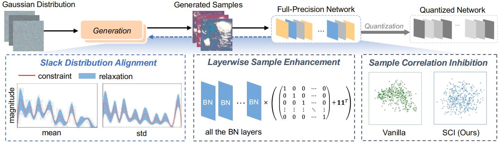
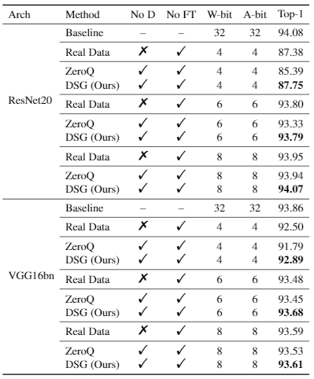
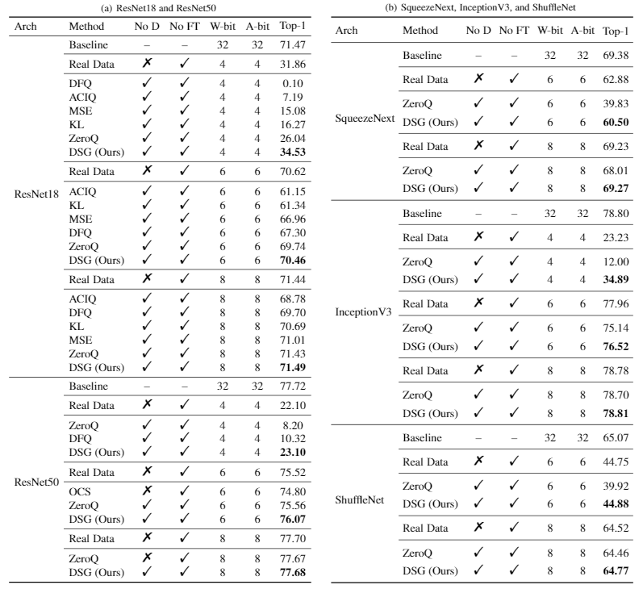
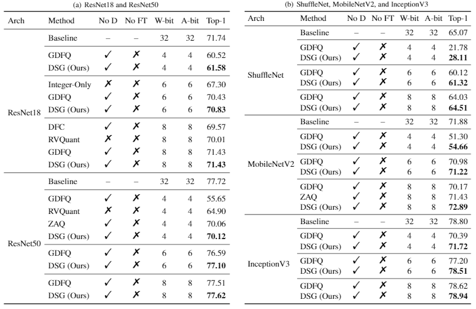

## ***Diverse Sample Generation: Pushing the Limit of Data-free Quantization***

Created by Haotong Qin, Yifu Ding, XiangguoZhang, Jiakai Wang, Xianglong Liu*, and Jiwen Lu from Beihang University and Tsinghua University.

### Introduction

This project is the official implementation of our paper *Diverse Sample Generation: Pushing the Limit of Data-free Quantization* [[PDF]( )]. Recently, generative data-free quantization emerges as a practical approach that compresses the neural network to low bit-width without access to real data. It generates data to quantize the network by utilizing the batch normalization (BN) statistics of its full-precision counterpart. However, our study shows that in practice, the synthetic data completely constrained by BN statistics suffers severe homogenization at distribution and sample level, which causes serious accuracy degradation of the quantized network. This paper presents a generic ***Diverse Sample Generation (DSG)*** scheme for the generative data-free post-training quantization (PTQ) and quantization-aware training (QAT), to mitigate the detrimental homogenization. In our DSG, we first slack the statistics alignment for features in the BN layer to relax the distribution constraint. Then we enhance the loss terms of specific BN layers for different samples and inhibit the correlation among samples in the generation process, to diversify samples from the statistical and spatial perspective, respectively. Extensive experiments show that for large-scale image classification tasks, our DSG can consistently outperform existing data-free quantization methods on various neural architectures, especially under ultra-low bit-width settings. Moreover, the data diversifying caused by our DSG brings a general gain in various quantization methods, demonstrating the diversity is an important property of high-quality synthetic data for data-free quantization. 

### Results

**Post-training Quantization on CIFAR10 dataset**

 

**Post-training Quantization on ImageNet dataset**

 

**Quantization-aware Training on ImageNet dataset**

 

*The code will be released soon.*